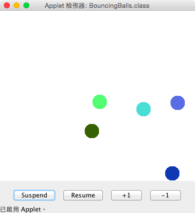

# Bouncing Balls
The applet allows you to add or remove bouncing balls.

>
The example in Section 18.8 simulates a bouncing ball. Extend the example to allow multiple balls, as shown in Figure 18.25a. You can use the + ̨1 or - ̨1 button to increase or decrease the number of the balls, and use the Suspend and Resume buttons to freeze the balls or resume bouncing. For each ball, assign a random color.

