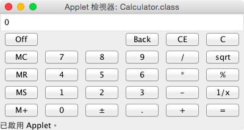

# Calculator Applet
Exercise 18.8 is a Java implementation of a popular calculator.
>
Use various panels of `FlowLayout`, `GridLayout`, and `BorderLayout` to lay out the following calculator and to implement addition (+), subtraction (-), division (/), square root (sqrt), and modulus (%) functions.

